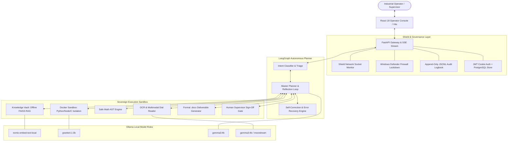

# 🛡️ KAVACH (सुरक्षा कवच)
### *Sovereign Air-Gapped Autonomous AI Operations Assistant for Critical Industrial Infrastructure*

[](https://github.com/himanshuupadhyay029-sys/onpremsih117)
[](https://github.com/himanshuupadhyay029-sys/onpremsih117)
[](https://github.com/himanshuupadhyay029-sys/onpremsih117)
[](https://github.com/himanshuupadhyay029-sys/onpremsih117)

---

## 📌 Executive Overview

**KAVACH** is a sovereign, zero-trust autonomous AI assistant built specifically for high-security industrial perimeters. Developed for **Smart India Hackathon 2026 (Problem Statement SIH26117)** for **Mangalore Refinery and Petrochemicals Limited (MRPL)**, KAVACH eliminates the security, confidentiality, and data-exfiltration risks inherent to cloud-based AI systems.

Unlike standard chatbots that send proprietary plant schematics and operational logs to public cloud endpoints, KAVACH executes **100% locally on standard on-premises hardware**. It unites multi-step agent reasoning, isolated code execution, hybrid document retrieval, multimodal diagram analysis, and active network-level lockdown into a unified command and control console.

```
+=======================================================================================+
|                                    AIR-GAPPED PERIMETER                               |
|                                                                                       |
|  [Operator UI] <---> [LangGraph Brain] <---> [Local SLMs via Ollama]                  |
|                             |                      (gemma3 / granite4.1 / nomic)      |
|                             +---> [Knowledge Vault (FAISS Offline RAG)]               |
|                             +---> [Isolated Docker Sandbox (--network none)]          |
|                             +---> [Multimodal OCR / Vision Engine]                    |
|                             +---> [Deterministic Math Calculator]                     |
|                             +---> [Human Supervisor Approval Gate]                    |
|                             +---> [Shield: Real-time Socket Sniffer & FW Lockdown]    |
|                                                                                       |
|                              ⛔ ZERO EXTERNAL TRAFFIC ⛔                              |
+=======================================================================================+
```

---

## ⚡ What Makes KAVACH Unique? (Core Differentiators)

| Feature | Typical Enterprise AI Chatbots | **KAVACH Autonomous Assistant** |
| :--- | :--- | :--- |
| **Data Privacy** | Sends proprietary data to cloud APIs (OpenAI / Anthropic) | **100% Local Inference**; not a single byte leaves the physical host |
| **Network Proof** | "Trust us" privacy policies | **Mathematical Proof via Socket Sniffer** + 1-click OS firewall lockdown |
| **Code Execution** | Unsafe local `exec()` or cloud functions | **Isolated Docker Sandbox** with zero network (`--network none`) and CPU caps |
| **Calculations** | LLM hallucinated math and token estimations | **Deterministic AST Math Engine** for zero-error operational calculations |
| **RAG Grounding** | Cloud vector DBs with frequent hallucination | **Dense FAISS Vector Index** with strict citation & threshold filtering |
| **High-Stakes Actions** | Unchecked automated execution | **Mandatory Human-in-the-Loop Approval Gate** before deliverable generation |
| **Multimodal Intake** | Requires cloud vision APIs | **Offline Tesseract OCR + Local Multimodal SLM** for dial/schematic scans |
| **Audit Compliance** | Transient or opaque cloud logs | **Immutable Append-Only JSONL Logbook** recording every agent action |

---

## 🏗️ System Architecture

KAVACH is structured into modular layers designed for high reliability, zero latency overhead, and ironclad operational security:



---

## 🚀 Key Modules & Capabilities

### 1. 🧠 Autonomous LangGraph Master Planner & Self-Correction
- **Dynamic Deconstruction:** Breaks complex operational queries (e.g., *"Calculate pump efficiency loss from the attached log, check against SOP #402, and draft an incident report"*) into ordered, executable sub-tasks.
- **Runtime Reflection Loop:** If a generated code script crashes in the sandbox or a calculation fails validation, the agent catches the traceback, re-reasons, fixes the error, and re-executes automatically without operator disruption.
- **Clarification Trigger:** Asks targeted follow-up questions when instructions lack critical operating parameters instead of making risky assumptions.

### 2. 📚 Offline Knowledge Vault (RAG on Air-Gapped SOPs)
- Ingests standard operating procedures, piping manuals, safety guidelines, and emergency playbooks (`.pdf`, `.md`, `.txt`, `.docx`, image scans).
- Uses local `nomic-embed-text` embeddings with a CPU-optimized **FAISS** index.
- Strict citation engine references exact document titles and text chunks, eliminating hallucinations on critical safety guidelines.

### 3. 📦 Isolated Multi-Language Docker Sandbox
- Runs generated analytical scripts (Python 3.11, Node.js 20, GCC 13 C) inside transient, isolated containers.
- Hardened with `--network none`, strict execution timeouts (15s), memory limits (256MB), and read-only root filesystems to prevent system tampering.

### 4. 👁️ Multimodal OCR & Industrial Dial Reader
- Integrates local **Tesseract OCR** with multimodal models (`gemma3:4b` / `moondream`).
- Extracts text from degraded digital inspection sheets and analyzes analog gauge readings, pressure displays, and technical drawings directly from scanned camera inputs.

### 5. 🛡️ Network Shield & Active Firewall Lockdown
- **Real-Time Socket Sniffer:** A background monitor continuously inspects all active network sockets on the host, categorizing traffic into `internal` (localhost/Postgres/Ollama) vs `external`.
- **Active Lockdown Mode:** A one-click toggle injects Windows Defender Firewall rules (`netsh advfirewall`) that drop all non-loopback outbound traffic, physically enforcing air-gapped isolation.

### 6. ✍️ Formal Deliverable Generator & Human Approval Gate
- Automatically formats structured incident summaries, shift handover reports, and compliance briefs into professional `.docx` deliverables.
- High-impact decisions or final document generation trigger a **Human Approval Modal** in the UI, requiring explicit operator sign-off before finalizing.

---

## 💻 Tech Stack

- **Backend Framework:** FastAPI (Python 3.11), SQLAlchemy, Alembic, Pydantic v2
- **Agent Orchestration:** LangGraph / Custom Agent State Machine with Server-Sent Events (SSE)
- **Local Model Serving:** Ollama (Local quantized GGUF execution)
  - `gemma3:4b` *(General Reasoning, Planning, Vision, Claim Verification)*
  - `granite4.1:3b` *(Code Generation & Automated Debugging)*
  - `nomic-embed-text:latest` *(Dense Vector Embeddings)*
- **Vector Search & RAG:** FAISS (CPU vector store), PyMuPDF, python-docx, Tesseract OCR
- **Execution Sandbox:** Docker (`python:3.11-slim`, `node:20-slim`, `gcc:13-slim` with `--network none`)
- **Database & Storage:** PostgreSQL 16 (persisting users, sessions, chats, and runs)
- **Frontend Console:** React 18, Vite, Tailwind-grade custom design system, Lucide icons
- **Security & Shield:** `psutil` network socket sniffer, Windows Defender Firewall API integration

---

## 🛠️ Step-by-Step Installation & Quickstart

### Prerequisites
1. **OS:** Windows 10/11 (64-bit) *(Recommended for full Shield lockdown)* or Linux.
2. **Python:** **Python 3.11** specifically (Required for FAISS & native bindings compatibility).
3. **Node.js:** Node.js 18+ and npm.
4. **Ollama:** Download and install from [ollama.com](https://ollama.com).
5. **Docker Desktop:** Running with WSL2 backend.
6. **Tesseract OCR:** Installed on the host (Default path: `C:\Program Files\Tesseract-OCR\tesseract.exe`).

---

### Step 1: Clone Repository & Setup Virtual Environment
```powershell
git clone https://github.com/himanshuupadhyay029-sys/onpremsih117.git
cd onpremsih117/kavach

# Create & activate Python 3.11 virtualenv
py -3.11 -m venv .venv
.\.venv\Scripts\Activate.ps1
```

### Step 2: Install Python Dependencies
```powershell
pip install -r requirements.txt
```

### Step 3: Pull Offline Ollama Models
Ensure the Ollama application is running, then pull the role-specific models:
```powershell
# Embeddings for Knowledge Vault RAG
ollama pull nomic-embed-text:latest

# Code Generation & Sandbox Execution
ollama pull granite4.1:3b

# Master Reasoning, Planning, Drafting & Vision
ollama pull gemma3:4b
```

### Step 4: Start PostgreSQL & Apply Schema Migrations
```powershell
# Starts PostgreSQL container on port 5434 (avoids local Postgres port collisions)
docker compose up -d postgres

# Run database migrations
python -m alembic upgrade head
```

### Step 5: Pull Sandbox Docker Images
```powershell
docker pull python:3.11-slim
docker pull node:20-slim
docker pull gcc:13-slim
```

### Step 6: Launch KAVACH

#### Terminal 1 — Start Backend API (FastAPI)
```powershell
# Run using the automated startup script (auto-checks admin elevation & database ready)
.\run_backend.ps1

# Or run directly:
python -m uvicorn backend.main:app --reload --host 0.0.0.0 --port 8000
```

#### Terminal 2 — Start Operator UI (React + Vite)
```powershell
cd frontend-react
npm install
npm run dev
```

Open your browser at **`http://localhost:5173`** to access the live operator console.
*(Interactive API documentation is accessible at `http://127.0.0.1:8000/docs`).*

---

## 📖 Knowledge Vault Batch Ingestion

To populate your Knowledge Vault with initial plant SOPs and manuals:

1. **Via UI:** Open the **Knowledge Vault** tab in the console, drop files (`.pdf`, `.md`, `.txt`, `.docx`, images), and click **Ingest into Vault**.
2. **Via Command Line:**
   ```powershell
   python scripts/ingest_docs.py testdata
   ```

---

## 🗂️ Repository Directory Layout

```
onpremsih117/
├── kavach/
│   ├── backend/
│   │   ├── audit/           # Immutable JSONL event logger
│   │   ├── auth/            # JWT authentication & session cookies
│   │   ├── brain/           # LangGraph planner, router, event bus & state machine
│   │   ├── chat/            # Chat history persistence routes
│   │   ├── db/              # SQLAlchemy database models & session management
│   │   ├── engine/          # Ollama client abstraction & models.json registry
│   │   ├── guard/           # Anti-hallucination verification & human approval gate
│   │   ├── shield/          # Windows firewall lockdown & socket sniffer
│   │   ├── tools/           # search, writer, code, sandbox, calc, ocr, vision
│   │   ├── vault/           # FAISS vector indexing, chunking & retrieval
│   │   ├── config.py        # Central configuration settings
│   │   ├── main.py          # FastAPI application entrypoint
│   │   └── models.json      # Model role mapping configuration
│   ├── frontend-react/      # Production React 18 + Vite Operator Console
│   ├── frontend/            # Standalone Vanilla HTML/JS UI fallback
│   ├── knowledge/           # FAISS vector store indexes and raw uploads
│   ├── migrations/          # Alembic database schema migrations
│   ├── outputs/             # Generated .docx reports and audit logs
│   ├── scripts/             # Ingestion & maintenance scripts
│   ├── testdata/            # Sample SOP documents & test scan images
│   ├── docker-compose.yml   # PostgreSQL service definition
│   ├── requirements.txt     # Locked Python 3.11 dependencies
│   └── run_backend.ps1      # Automated backend startup script
├── .gitignore
└── README.md
```

---

## 🏆 Smart India Hackathon 2026 Context

- **Problem ID:** SIH26117
- **Target Organization:** Mangalore Refinery and Petrochemicals Limited (MRPL)
- **Theme:** Smart Automation / Air-Gapped Industrial Security
- **Core Mission:** Demonstrating that critical national infrastructure and refinery operations can achieve state-of-the-art autonomous AI assistance with **zero cloud dependencies and verifiable sovereign isolation**.
