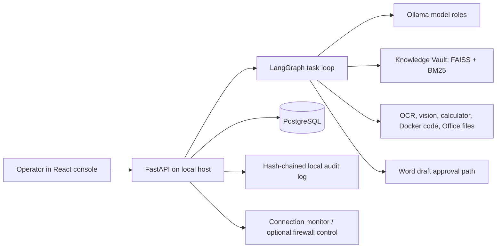

# 🛡️ KAVACH (सुरक्षा कवच)

### Sovereign on-premise agentic AI workbench for industrial knowledge work


KAVACH is a local-first prototype for working with confidential procedures, inspection records, technical images and engineering tasks. The operator console connects to a FastAPI service, a LangGraph task loop, locally served Ollama models, a document vault and local tools. It can retrieve source passages, read scans, calculate, run code in Docker and prepare reviewable Office files.

The core workflow runs on equipment controlled by the organization. Model inference uses the configured local Ollama endpoint; the application does not require a hosted AI API for normal task execution. Installers, model weights and Docker images must be obtained **before** a disconnected run. The model catalogue and pull controls in the settings UI are provisioning features and need connectivity when used to download models.

## What is implemented

| Area | Current implementation |
| --- | --- |
| Agent workflow | LangGraph planner, task router, executor, observer, revision, replanning, clarification and final response. The current loop caps plans at eight steps and revisions at two. |
| Local model roles | Configurable reasoning, code, vision, embedding and reranking roles in [`kavach/backend/models.json`](kavach/backend/models.json). |
| Knowledge Vault | Text, Markdown, PDF, DOCX and image ingestion; hierarchical chunks; FAISS dense search plus BM25 lexical search, reciprocal-rank fusion, context expansion and local reranking. |
| Multimodal tools | Tesseract OCR for scans and image-only PDFs; a local vision-model path for image descriptions and questions. |
| Calculations and code | Model-assisted formula/input extraction followed by an AST arithmetic evaluator; Python, JavaScript and C execution in transient Docker containers. |
| Deliverables | DOCX, XLSX and PPTX generation. Formal Word drafts assessed as medium or high risk can pause for an authorized approval, edit or rejection decision. |
| Records and controls | PostgreSQL users, chats, runs and document metadata; role and department checks on supported routes; per-user hash-chained JSONL audit logs; a host connection monitor and optional Windows firewall lockdown. |

These components assist an engineer; they do not certify a safety-critical decision. In particular, an image description of a P&ID, gauge or drawing should be checked against the source image by a qualified reviewer.

## Local architecture


```mermaid
flowchart LR
    Operator[Operator in React console] --> API[FastAPI on local host]
    API --> Agent[LangGraph task loop]
    Agent --> Models[Ollama model roles]
    Agent --> Vault[Knowledge Vault: FAISS + BM25]
    Agent --> Tools[OCR, vision, calculator, Docker code, Office files]
    Agent --> Approval[Word draft approval path]
    API --> DB[(PostgreSQL)]
    API --> Audit[Hash-chained local audit log]
    API --> Shield[Connection monitor / optional firewall control]
```

The model registry currently ships with these assignments:

| Role | Model tag |
| --- | --- |
| Reasoning and planning | `gemma3:4b` |
| Code | `granite4.1:3b` |
| Vision | `gemma3:4b` |
| Embeddings | `nomic-embed-text:latest` |
| Reranking | `gemma3:4b` |

An administrator can change role assignments in the model settings UI. The registry can fall back to another installed model when an assigned tag is unavailable, so check the active assignments before recording a result or demo.

## Local setup

The following path is for **Windows 10/11 with PowerShell**. The backend also uses portable Python, Ollama, Docker and PostgreSQL components on Linux; Windows Defender firewall lockdown and its helper scripts are Windows-specific.

### 1. Install prerequisites

- Python 3.11, Node.js 18+ and npm.
- Ollama running locally (default endpoint `http://127.0.0.1:11434`).
- Docker Desktop with its daemon running.
- Tesseract OCR installed on the host. On Windows, the OCR code checks the usual `C:\Program Files\Tesseract-OCR\tesseract.exe` location.

Clone the repository, then create a Python environment from the `kavach` directory:

```powershell
git clone https://github.com/himanshuupadhyay029-sys/onpremsih117.git
cd onpremsih117\kavach
py -3.11 -m venv .venv
.\.venv\Scripts\Activate.ps1
python -m pip install -r requirements.txt
cd frontend-react
npm install
cd ..
```

### 2. Prepare local models and Docker images

Run these downloads **while connected**, before moving to a disconnected environment:

```powershell
ollama pull gemma3:4b
ollama pull granite4.1:3b
ollama pull nomic-embed-text:latest

docker pull postgres:16-alpine
docker pull python:3.11-slim
docker pull node:20-slim
docker pull gcc:13-slim
```

`gemma3:4b` covers reasoning, vision and reranking in the checked-in registry. The three language images are used by the code sandbox; they are not language models. Verify the local model cache with `ollama list` and the Docker cache with `docker image ls`.

### 3. Start the database and create an administrator

From `onpremsih117\kavach`:

```powershell
docker compose up -d postgres
python -m alembic upgrade head
python scripts/create_admin.py
```

The compose file uses PostgreSQL 16 and maps host port `5434` to the container. The bootstrap script prompts for an administrator account. Subsequent users can be provisioned through the admin interface and assigned a role and department. The code also permits the first registration to become an administrator, but the bootstrap script is the clearer operator path.

The checked-in database credentials and fallback JWT secret are development defaults. Set a private `JWT_SECRET_KEY`, and change the database password and matching `DATABASE_URL`, before using real organizational data.

### 4. Run the backend and console locally

In a PowerShell terminal with the virtual environment active:

```powershell
python -m uvicorn backend.main:app --host 127.0.0.1 --port 8000
```

In a second terminal opened in `onpremsih117\kavach`:

```powershell
cd frontend-react
npm run dev -- --host 127.0.0.1
```

Open `http://127.0.0.1:5173` and sign in with the administrator account. The API health endpoint is `http://127.0.0.1:8000/health`; interactive API documentation is at `http://127.0.0.1:8000/docs`.

`kavach/run_backend.ps1` is an alternative Windows runner that checks PostgreSQL, applies migrations and starts Uvicorn. It binds to `0.0.0.0`, so use the loopback command above when you want the API accessible only from the same machine.

## Using the workbench

1. **Upload source material.** In Knowledge Vault, ingest a `.txt`, `.md`, `.pdf`, `.docx`, `.png`, `.jpg`, `.jpeg`, `.tiff`, `.bmp` or `.webp` file. Scanned material is processed through OCR. UI uploads are stored in a per-user vault; documents can be tagged with a department and classification.
2. **Ask a task.** A request may involve search, OCR/vision, arithmetic, code, a Word document, an Excel workbook or a PowerPoint deck. The planner chooses one or more tool steps and can ask for clarification when essential information is missing.
3. **Inspect the result.** Retrieval returns source filenames and excerpts; code tasks return execution output; calculation tasks show arithmetic steps. Check source evidence and units before operational use.
4. **Review formal Word drafts.** When the risk heuristic marks a Word draft medium or high risk, the approval path can hold it for an approver or administrator. The reviewer can approve, edit or reject; department checks apply to approvers.

For bulk ingestion into the separate default CLI index, run `python scripts/ingest_docs.py testdata` from `kavach`. To populate an authenticated user's own vault, use the UI upload flow.

## Local controls and their scope

- **Code isolation:** `backend/tools/sandbox.py` starts Python, Node or GCC containers with `--network none`, a read-only source-file mount, a 256 MB memory limit, a one-CPU limit and a 15-second default wall-clock timeout. Images must be present locally before a disconnected run. These flags isolate the generated code process; they do not make the whole host air-gapped.
- **Access and review:** Account, vault, audit and approval routes contain authentication, role or department checks. The codebase is a prototype and not every task or model-management endpoint uses the same gate. Keep the API on a trusted local interface and review authorization before wider network exposure.
- **Audit:** Events are appended to local per-user JSONL files with SHA-256 hash chaining and a verification endpoint. This can reveal changes to recorded entries; a host administrator can still alter or delete local files, so it is not immutable storage.
- **Network visibility:** The shield monitors observed host connections and records session snapshots locally. Its counters describe observed connections, not a mathematical proof that no data left the machine.
- **Firewall:** Windows lockdown is optional. Applying Windows Defender rules requires elevated permission through an elevated process, a configured privileged scheduled task or the UI's UAC flow. Check `hardware_enforced` in the firewall status rather than assuming a button press applied rules. Linux has no equivalent Windows firewall control in this repository.

Core inference and document processing use local services after provisioning. Pulling models, packages or Docker images, and querying remote model-catalogue information, are provisioning operations that require connectivity. A disconnected run should be tested on the exact prepared machine.

## Code and checks

The implementation lives under `kavach/`:

```text
kavach/
├── backend/
│   ├── brain/          LangGraph planner, router and tool dispatch
│   ├── engine/         Ollama client and model registry
│   ├── vault/          Ingestion, FAISS/BM25 retrieval and reranking
│   ├── tools/          OCR, vision, math, Docker code and Office builders
│   ├── auth/           Sessions, roles and user management
│   ├── guard/          Verification and Word approval logic
│   ├── audit/          Hash-chained event logs
│   ├── shield/         Connection monitor and Windows firewall control
│   └── models.json     Checked-in model role assignments
├── frontend-react/    React/Vite operator console
├── migrations/        PostgreSQL schema migrations
├── scripts/           Admin bootstrap, ingestion and firewall helpers
├── testdata/          Synthetic/example procedures
├── test_*.py          Component and workflow checks
└── docker-compose.yml PostgreSQL and optional frontend services
```

With `pytest` installed in the environment, selected tests can be run from `kavach`:

```powershell
python -m pytest test_rbac_approval_audit.py test_code_sandbox.py test_search_improvements.py
```

Some checks use mocks; integration behavior also depends on the local Ollama models, PostgreSQL, Docker and Tesseract being available. Treat individual OCR confidence values as engine estimates, not measured transcription accuracy, and validate P&ID interpretation against labeled plant-specific examples before relying on it.

KAVACH addresses the Smart Automation theme . The goal is to bring multi-step AI assistance to industrial knowledge work while keeping the normal inference path and working data within an organization-controlled local environment.
